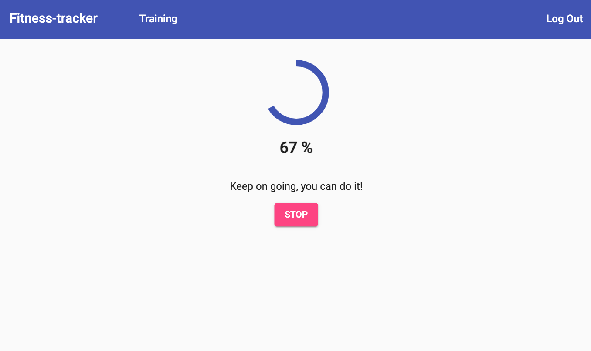

# Fitness Tracker
See demo by [this link](https://zoromari.github.io/fitness-tracker) 

#### Functionality

This is an interesting project that provides a tools for tracking and logging your fitness exercises.

You can start/pause and storp your selected exercise at any time and save your progress.

You can also see all your past exercises in a convenient table with sorting and filtering, as well as check your previous progress.

 

#### Technologies:

This project was generated with **Angular**.
For this project, I used the **Material components and theme**.

During developing of this project I worked with such features: 
- create Components
- create and use Services and Dependency Injection (Cross component communication)
- work with RxJS (Observables, Operators)
- use Pipes to transform Output
- create Forms (with Template-Driven and Reactive approach)
- work with **Firebase** and with **AngularFire** for storing and fetching data
- add Authentication and Route Protection
- optimize app with splitting Modules and adding Lazy Loading 
- uses many Angular Material components

